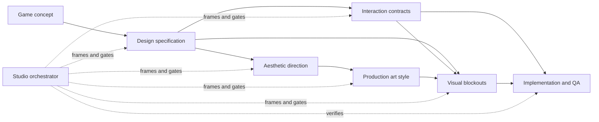

# Game Factory

Game Factory is a skills-only Codex plugin for designing, validating, and prototyping games as a traceable production system. It helps a team move from a loose concept to testable design rules, interaction metadata, a coherent aesthetic, a production-ready art style, validated silhouettes or greyboxes, and stage-gated milestone decisions.

The plugin is built around one principle: keep each kind of decision in its proper source of truth. Player intent belongs in the design specification. Cross-system behavior belongs in interaction contracts. Mood and meaning belong in the aesthetic direction. Production representation belongs in the art-style guide. Shape and spatial evidence belong in blockouts. Cross-discipline tradeoffs belong in milestone decision records.

Current version: `0.1.0`

## What is included

| Skill | Use it to answer | Typical outputs |
|---|---|---|
| [`game-design-spec`](game-factory/skills/game-design-spec/SKILL.md) | What game are we building, for whom, under which rules and scope? | Concept briefs, prototype briefs, vertical-slice specs, production GDDs, stable requirement IDs, scope and acceptance criteria |
| [`game-interaction-contracts`](game-factory/skills/game-interaction-contracts/SKILL.md) | How does a player verb or stateful exchange behave across participants and systems? | Interaction contracts, flows, bindings, indexes, semantic hooks and acceptance cases |
| [`game-aesthetic`](game-factory/skills/game-aesthetic/SKILL.md) | What should the game world feel like? | Controlled concept-art explorations, scorecards, mood evidence and `AESTHETIC_DIRECTION.md` |
| [`game-art-style`](game-factory/skills/game-art-style/SKILL.md) | How will the locked aesthetic be made consistently and readably in production? | Production-style comparisons, spikes, visual rules, asset tiers and `ART_STYLE_GUIDE.md` |
| [`game-visual-blockout`](game-factory/skills/game-visual-blockout/SKILL.md) | Does the shape, scale, space or gameplay footprint work before finish? | Silhouettes, footprints, greyboxes, production proxies and AI-ready construction handoffs |
| [`game-studio-orchestrator`](game-factory/skills/game-studio-orchestrator/SKILL.md) | Which specialists and evidence does this milestone need? | GPT-5.6 Sol Ultra assignments, stage-gate decisions, evaluation packets, decision records and next-milestone plans |

Each skill includes its own instructions, templates, reference material and, where useful, validation or contact-sheet scripts.

## How the skills fit together



This is not a mandatory waterfall. Interaction work and aesthetic exploration can proceed in parallel once their design inputs are stable. A first playable can use temporary art, while production-art commitments should wait for a locked aesthetic and a representative production test.

## Recommended workflow

### 1. Frame the game

Start with `game-design-spec`. Choose the smallest useful document depth:

- **Concept brief** for player fantasy, audience, differentiators, pillars and scope boundaries.
- **Prototype brief** for one risky design question and the minimum experiment that can answer it.
- **Vertical-slice spec** for a representative segment at target quality.
- **Production spec** for a durable, interconnected source of truth across the full project.

The skill converts subjective goals into rules, stable IDs and observable acceptance criteria. Unknowns remain explicit assumptions or open decisions instead of becoming accidental requirements.

### 2. Model important interactions

Use `game-interaction-contracts` when behavior crosses multiple participants, states, systems, scenes, assets or tests. Examples include combat abilities, traversal verbs, shops, conversations, puzzles, pickups, scripted sequences and multiplayer exchanges.

The core records are:

- **Contract:** the reusable semantic behavior and state rules.
- **Flow:** a multi-step or branching interaction sequence.
- **Binding:** the scene- or prefab-specific mapping to input, animation, UI, audio, VFX, camera, sockets, volumes and tuning values.
- **Index:** a project-wide registry for discovery and change propagation.

This keeps interaction metadata machine-readable without treating individual art assets as the only source of behavior.

### 3. Discover the game's aesthetic

Use `game-aesthetic` to answer what the world should feel like before selecting pixel art, painted 2D, low-poly 3D or another production method.

The default exploration funnel is:

1. Generate eight distinct aesthetic territories around one invariant world anchor.
2. Score all eight and shortlist three.
3. Range-test each finalist in ordinary, aspirational and dangerous conditions.
4. Refine the top territory or compare the top two on one controlled variable.
5. Lock the result in `AESTHETIC_DIRECTION.md`.

Every generated candidate retains its exact prompt, reference-image roles, output path and compliance notes. Contact sheets and evidence-based scorecards keep the choice from collapsing into “we liked this image.”

### 4. Translate the aesthetic into an art-production system

Use `game-art-style` only after the emotional and thematic direction is stable. It compares viable ways to reproduce that aesthetic under the game's camera, platform, engine, team, animation, content and performance constraints.

Concept images are treated as hypotheses. The top candidates should also survive a small production spike in the team's real tools. The final `ART_STYLE_GUIDE.md` captures shape, value, palette, material, lighting, animation, camera-readability, asset-tier, format and budget rules.

### 5. Prove shape and space before polish

Use `game-visual-blockout` at the lowest fidelity that answers the current question:

- **L0 footprint:** bounds, floor plans, reach, traversal, camera or occupancy.
- **L1 silhouette:** outer contour, negative space, proportion, stance and recognition.
- **L2 greybox:** masses, functional zones, articulation, clearances, collision and scale.
- **L3 production proxy:** pivots, sockets, motion ranges, modular seams, material zones and engine-handoff constraints.

Selected blockouts become precise AI construction handoffs. These specify dimensions, mass hierarchy, contour landmarks, gameplay function, sockets, pivots, collision, clearances, modularity, technical budgets, allowed variation and rejection checks so a downstream AI or artist does not have to guess.

### 6. Gate consequential milestones with a specialist council

Use `game-studio-orchestrator` when a decision benefits from multiple independent disciplines. It selects only the relevant roles, gives each a bounded evidence packet, assigns explicit authority, and synthesizes one decision.

The orchestrator pins specialist agents to `gpt-5.6-sol` with `ultra` reasoning. Its roster includes:

- creative director;
- game design lead;
- player advocate;
- scope producer;
- aesthetic director;
- art style director;
- technical director;
- gameplay engineer;
- content and level designer;
- UX and accessibility lead;
- QA and test lead;
- performance and platform lead;
- an independent milestone evaluator.

Specialists are advisory unless an assignment grants a bounded write scope. The evaluator is always read-only and must not have contributed to the work being judged.

## Stage gates

| Gate | Question | Exit evidence |
|---|---|---|
| **0 — Framed opportunity** | Is there a coherent opportunity worth specifying? | Concept brief and named prototype question |
| **1 — Prototype contract** | Can a minimum playable experiment answer the riskiest design question? | Buildable prototype brief with success, revise and stop criteria |
| **2 — Aesthetic direction** | What should the world feel like across its emotional range? | `AESTHETIC_DIRECTION.md` and retained comparison evidence |
| **3 — Production art style** | Which visual system expresses the aesthetic and survives production constraints? | `ART_STYLE_GUIDE.md`, reference set and representative pipeline test |
| **4 — Playable prototype** | Does the core interaction create the intended player behavior and feeling? | Reproducible first playable and structured observations |
| **5 — Vertical slice** | Can the team make one representative segment at target quality and cost? | Integrated slice, measured throughput and updated scope forecast |
| **6 — Acceptance** | Are committed criteria met with acceptable residual risk? | Criterion-level validation and an independent evaluation |

A gate ends in `Pass`, `Revise`, `Stop` or `Experiment`. Missing evidence never becomes a ceremonial pass.

## Installation

Game Factory is currently packaged as a skills-only plugin under [`game-factory/`](game-factory/). It does not require an MCP server or an external service connection.

### Prerequisites

- A current Codex or ChatGPT desktop build with plugin support.
- Access to this repository if it remains private.
- Image generation access for concept-art and silhouette batches.
- Python 3 for the included validators.
- Pillow only when building visual contact sheets.

### Clone the source

```bash
gh repo clone alexmeckes/gamefactory-skills
cd gamefactory-skills
```

### Add it to a personal marketplace

This repository contains the plugin package but does not yet contain a repo-level marketplace catalog. For local development, use the built-in `plugin-creator` skill to add the package to your personal marketplace:

```text
Use $plugin-creator to add ./game-factory to my personal marketplace, then install and enable Game Factory.
```

Restart the ChatGPT desktop app after changing a local marketplace, then open a new task so skill discovery is refreshed. Installed skills are typically displayed with the `game-factory:` namespace.

You can inspect the local plugin state from the CLI:

```bash
codex plugin marketplace list
codex plugin list --available --json
```

See the official OpenAI documentation for [plugin packaging and local marketplaces](https://developers.openai.com/plugins/build/plugins) and [complete-plugin testing](https://developers.openai.com/plugins/deploy/connect-chatgpt).

## Using the plugin

You can invoke a skill explicitly by its displayed name or describe the desired outcome naturally. Start with the artifact or decision you need, not with an instruction to “use every skill.”

### Design-spec examples

```text
Turn this co-op extraction game concept into a prototype brief. Identify the riskiest design question, define the minimum playable loop, and give every committed mechanic a testable acceptance criterion.
```

```text
Review our current GDD against the implementation. Classify every discrepancy as a design change, implementation defect, or unresolved decision, and update the decision log without rewriting unrelated sections.
```

### Interaction examples

```text
Create an interaction contract for appraising and buying a cursed item. Include participants, preconditions, state transitions, cancellation, failure recovery, semantic hooks, accessibility feedback and acceptance cases.
```

```text
Index the project's traversal interactions and reconcile their bindings against the current prefabs, animation events, input actions and tests.
```

### Aesthetic examples

```text
Explore eight aesthetic territories for this game using one controlled world anchor. Keep the rendering medium neutral, score the results, range-test the top three, and produce an AESTHETIC_DIRECTION.md.
```

```text
Our current direction feels generically cozy. Create a controlled refinement round that preserves the world facts while testing three sharper tensions between hospitality and unease.
```

### Art-style examples

```text
Translate the locked aesthetic into four viable production styles for an isometric game on Switch. Hold the scene and palette meaning constant, compare readability and feasibility, and define the smallest production spike for the top two.
```

```text
Turn the selected stylized-3D direction into an ART_STYLE_GUIDE.md with asset tiers, material rules, animation language, camera-readability checks and engine budgets.
```

### Blockout examples

```text
Generate six L1 silhouettes for this enemy archetype. Preserve its combat role, scale and camera framing, vary only the shape thesis, and write a candidate record for every silhouette.
```

```text
Create an L2 greybox brief for this shop counter, including player and NPC access, item presentation zones, interaction volumes, animation clearances, pivots, sockets and collision constraints. Then prepare an AI-ready Blender handoff for the selected candidate.
```

### Studio-orchestration examples

```text
Use the Game Factory studio orchestrator for our first-playable milestone. Run the smallest useful council on GPT-5.6 Sol Ultra, keep reviewers independent, assign only one writer, and require a fresh evaluator before recommending a gate pass.
```

```text
Frame a Gate 3 decision between the two surviving art styles. Use the art style director, technical director and performance lead, then design a reversible production spike for the contested assumption.
```

## Artifacts and traceability

The skills use stable identifiers and file references so changes can propagate without duplicating source rules:

- Design requirements use discipline-specific IDs such as `COMBAT-DODGE-001`.
- Interaction contracts use namespaced IDs such as `shop.appraise-cursed-item`.
- Aesthetic candidates use `E01`, `E02` and so on.
- Art-style candidates use `A01`, `A02` and so on.
- Visual blockouts use `B01`, `B02` and so on within a subject folder.
- Milestone criteria and decisions use project-specific stable IDs.

Downstream artifacts should point back to the exact upstream IDs and paths they implement. When a rule changes, review its dependents instead of silently changing several copies of the same information.

## Included templates and tools

### Design specification

- `concept-brief.md`
- `prototype-spec.md`
- `vertical-slice-spec.md`
- a production document set covering game design, loops, systems, content, UX, scope and decisions
- `validate_spec.py` for structural validation

Example:

```bash
python3 game-factory/skills/game-design-spec/scripts/validate_spec.py path/to/spec.md --strict
```

### Interaction metadata

- `INTERACTION_CONTRACT.yaml`
- `INTERACTION_FLOW.yaml`
- `INTERACTION_BINDING.yaml`
- `INTERACTION_INDEX.yaml`
- `validate_interactions.py` for schema and handoff checks

Example:

```bash
python3 game-factory/skills/game-interaction-contracts/scripts/validate_interactions.py path/to/interactions --strict
```

### Visual development

- aesthetic and art-style briefs, scorecards and locked-direction templates
- candidate and AI asset-handoff records for visual blockouts
- Pillow-based contact-sheet builders for normalized comparison batches

Install the optional contact-sheet dependency when needed:

```bash
python3 -m pip install Pillow
```

Then run:

```bash
python3 game-factory/skills/game-aesthetic/scripts/build_contact_sheet.py path/to/candidates --output contact-sheet.png
```

### Studio operation

- agent assignment contracts;
- milestone packets;
- decision records;
- independent evaluation packets;
- durable studio-state templates;
- role and stage-gate references.

## Suggested project layout

Game Factory adapts to an existing project convention. For a new project, a practical starting point is:

```text
docs/
├── design/
│   ├── GAME_DESIGN.md
│   ├── CORE_LOOP.md
│   ├── SYSTEMS.md
│   ├── CONTENT_PLAN.md
│   ├── UX_FLOW.md
│   ├── PRODUCTION_SCOPE.md
│   └── DECISIONS.md
├── interactions/
│   ├── INTERACTION_INDEX.yaml
│   ├── contracts/
│   ├── flows/
│   └── bindings/
└── studio/
    ├── STUDIO_STATE.md
    ├── milestones/
    └── decisions/
art/
├── aesthetic-exploration/
│   ├── AESTHETIC_BRIEF.md
│   ├── round-01-territories/
│   ├── round-02-range-tests/
│   ├── contact-sheets/
│   ├── AESTHETIC_SCORECARD.md
│   └── AESTHETIC_DIRECTION.md
├── art-style/
│   ├── ART_STYLE_BRIEF.md
│   ├── candidate-translations/
│   ├── production-spikes/
│   ├── contact-sheets/
│   ├── ART_STYLE_SCORECARD.md
│   └── ART_STYLE_GUIDE.md
└── blockouts/
    ├── briefs/
    ├── candidates/
    ├── selected/
    └── handoffs/
```

## Repository layout

```text
gamefactory-skills/
├── README.md
└── game-factory/
    ├── .codex-plugin/
    │   └── plugin.json
    └── skills/
        ├── game-aesthetic/
        ├── game-art-style/
        ├── game-design-spec/
        ├── game-interaction-contracts/
        ├── game-studio-orchestrator/
        └── game-visual-blockout/
```

Every skill directory follows the same broad structure:

- `SKILL.md` defines triggering, workflow, boundaries and completion requirements.
- `agents/openai.yaml` supplies skill presentation metadata.
- `assets/` contains reusable artifact templates.
- `references/` contains deeper methods and quality bars loaded only when needed.
- `scripts/` contains deterministic helpers where automation adds value.

## Development principles

- Use the smallest skill set and document depth that answer the current decision.
- Preserve uncertainty as an assumption, open question or bounded experiment.
- Compare controlled candidates; do not vary content, camera, medium and mood simultaneously.
- Keep generated-image prompts, reference roles and provenance with the artifact.
- Treat concept art as evidence for direction, not proof of production feasibility.
- Prefer low-fidelity prototypes until recognition, function, scale or flow is proven.
- Give subagents one role, one decision, a bounded evidence packet and explicit write authority.
- Keep writers and independent evaluators separate.
- Pass a gate only when every required criterion has observable evidence.
- Preserve user changes and keep generated outputs in named, non-overwriting paths.

## Updating the plugin

When changing a skill:

1. Keep its frontmatter description specific enough to trigger only for the intended requests.
2. Update related templates or references when the artifact contract changes.
3. Run the relevant validator or helper against a representative example.
4. Test direct, indirect, follow-up, negative and boundary prompts in a new task.
5. Update the version in [`plugin.json`](game-factory/.codex-plugin/plugin.json) when preparing a release.
6. Refresh or reinstall the local marketplace copy before evaluating the new version.

The plugin manifest is [`game-factory/.codex-plugin/plugin.json`](game-factory/.codex-plugin/plugin.json). Game Factory currently bundles workflows only; a future MCP server would be appropriate for live project registries, generation jobs, build or playtest evidence, telemetry and external actions—not for hiding stable workflow instructions or templates.

## Status

Game Factory is an early, working plugin (`0.1.0`). Its six skills, templates, references and validation helpers are present in this repository. It is installed and tested through a local or personal marketplace workflow; a repo-level marketplace catalog and public directory release are not included yet.
